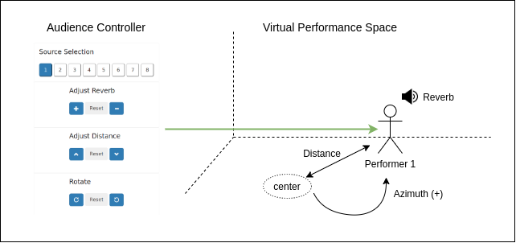

# Sprawl Audience Control

> ss2021 Interactive Performance Piece [sprawl.hvc.berlin](http://sprawl.hvc.berlin/)

### Description

The Audience Control project is a project designed to allow and encourage viewer participation in the performance. 

1. First, the user can select one of the 8 various performers on the top of the screen by the numbered buttons,
2. The controls will adjust the spatial signals of the respective performer. The audio controls provided are reverb, distance, and azimuth, 
    - Reverb controls can increase or decrease the amount of signal reflection in the acoustic space.
    - Distance controls virtually how far the performer is from a center point
    - Azimuth and at which clockwise angle the performer is from 0 degrees.
    
3. Guess which audio source belongs to which performer shown on screen, and the results will be displayed when the performance is complete.

    - The performance piece will have different performers playing at different times, which will allow viewers a more easy opportunity to determine which sources belong with which users.

  

### How to Deploy

Run `deploy.sh` in downloaded directory.

## TODO

1. change button UI
2. use UWSGI for flask to start
3. fix endpoints for flask/supercollider thing
4. Add guessing game
5. Add backend thing for guessing game
